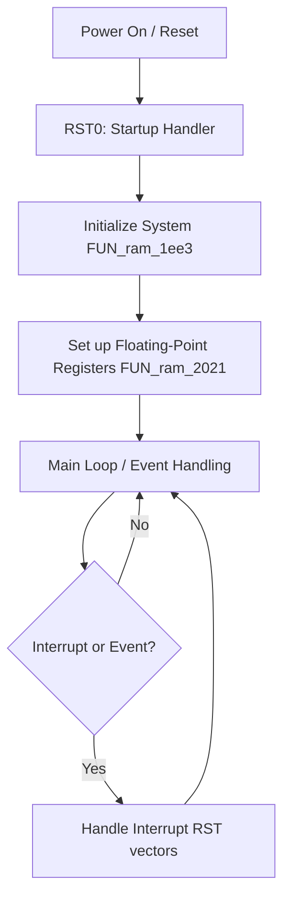
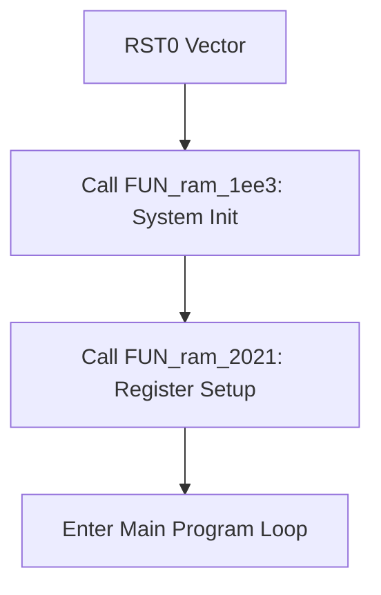
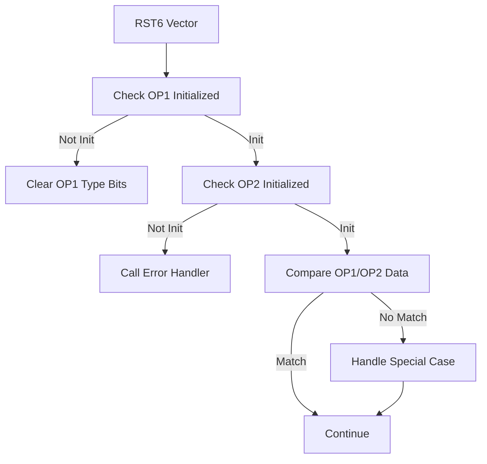
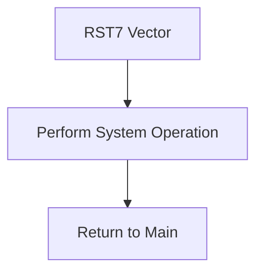

# TI-85 ROM Flow Diagram

This document illustrates the main program flow and interrupt loops based on the TI-85 ROM disassembly.

## Main Program Flow

## Interrupt Loops

### RST0 (Startup)

### RST6 (System Function)

### RST7 (System Function)

### Other Interrupts
- RST1-RST5: Thunk to floating-point operations (add, multiply, divide, etc.)
- General Interrupt Handler: Handles peripherals

## Key Functions Overview

- **FUN_ram_1f8e**: System state validation for OP1/OP2
- **FUN_ram_2021**: Initialize floating-point register stack
- **Copy Routines**: LAB_ram_209b (11 bytes), LAB_ram_209d (10 bytes)
- **Interrupt Handlers**: RST vectors for system calls and hardware interrupts

This diagram provides a high-level view of the program structure. For detailed code paths, refer to the disassembly.
